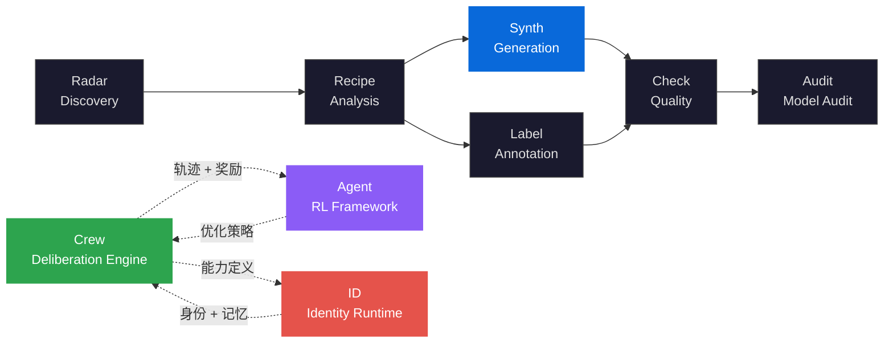

<div align="center">

<h1>DataSynth</h1>

<h3>LLM-Powered Synthetic Dataset Generation<br/>with Quality-Diversity Optimization</h3>

<p><strong>LLM 驱动的合成数据生成引擎 — 智能模板 · 并发生成 · Schema 验证 · 成本精算</strong><br/>
<em>Seed-to-scale synthetic data engine with auto-detected templates, concurrent generation, schema validation, and precise cost estimation</em></p>

[](https://pypi.org/project/knowlyr-datasynth/)
[](https://pypi.org/project/knowlyr-datasynth/)
[](https://www.python.org/downloads/)
[](LICENSE)
<br/>
[](https://github.com/liuxiaotong/data-synth/actions/workflows/ci.yml)
[](#mcp-server)
[](#key-innovations)
[](#key-innovations)

[Abstract](#abstract) · [Problem Statement](#problem-statement) · [Formal Framework](#formal-framework) · [Architecture](#architecture) · [Key Innovations](#key-innovations) · [Quick Start](#quick-start) · [MCP Server](#mcp-server) · [Ecosystem](#ecosystem) · [References](#references)

</div>

---

## Abstract

高质量训练数据是 LLM 性能的关键瓶颈。人工标注成本高（$0.1–$10/条）、速度慢（100 条/天）、一致性差（标注员理解差异），而简单的 LLM 批量调用又缺少质量保证——重复样本、违反 Schema 约束、分布偏斜等问题无法自动检测。

DataSynth 提出**种子驱动的合成数据生成框架** (seed-driven synthetic generation)：从少量种子数据（50 条）出发，通过**智能模板选择** (auto-detected templates) 匹配最佳 Prompt 策略，**并发批量生成** + **Schema 验证** + **跨批次去重**，以 $0.001–$0.01/条的成本生产高质量训练数据。系统实现「**种子 → 模板 → 生成 → 验证 → 去重 → 统计**」的完整管线，支持增量续跑和后置钩子自动触发质检。

> **DataSynth** implements a seed-driven synthetic data generation framework. The system auto-detects data types (instruction-response / preference pairs / multi-turn dialogue), selects specialized prompt templates, generates data via concurrent LLM calls (Anthropic / OpenAI), validates against Schema constraints (type / range / enum / length), deduplicates across batches, and provides precise cost estimation based on per-model pricing. Supports incremental resume, retry with temperature escalation, and post-generation hooks.

---

## Problem Statement

合成数据生产面临三个根本性挑战：

| 根本性问题 | 形式化定义 | 现有方案局限 | DataSynth 的方法 |
|:---|:---|:---|:---|
| **成本-规模矛盾**<br/>Cost-Scale Dilemma | 人工标注成本 $c_h \gg c_{llm}$，但 LLM 生成缺少质量保证 | 简单批量调用无验证，"量大质低" | Schema 验证 + 去重 + 重试温度递增，成本降至 $0.001–$0.01/条 |
| **模板盲选**<br/>Template Blindness | 指令-回复、偏好对、多轮对话需要不同的生成策略 | 通用 Prompt 生成所有类型，质量低 | 自动检测数据类型，选用专用 Prompt 模板 |
| **生成断裂**<br/>Generation Fragmentation | 大批量生成中断后需从头重来，已有结果浪费 | 无增量续跑，重复消耗 API 和成本 | 增量续跑 (`--resume`) + 并发批量 + 后置钩子自动质检 |

> DataSynth 不是通用 LLM 调用工具。它是 **LLM 训练数据的生产线**——从种子数据到大规模合成数据的端到端管线，质量可验证、成本可预估、流程可恢复。

---

## Formal Framework

### Generation Model

合成数据生成形式化为映射函数：

$$G: (\mathcal{S}, \mathcal{T}, \theta) \to D'$$

其中 $\mathcal{S} = \{s_1, \ldots, s_k\}$ 为种子数据集（$k \approx 50$），$\mathcal{T}$ 为模板函数（由数据类型自动选择），$\theta = (\text{model}, \text{temperature}, \text{max\_tokens})$ 为生成参数，$D'$ 为合成数据集。

### Quality-Diversity Trade-off

合成数据需要同时满足质量和多样性：

$$\max_\theta \;\mathbb{E}_{d \sim D'}[Q(d)] \quad \text{s.t.} \quad H(D') \geq H_{\min}$$

其中 $Q(d)$ 为样本质量（Schema 合规性），$H(D')$ 为数据集熵（多样性度量）。

**Schema 验证**确保质量：类型检查 + 约束校验（range / enum / length），不合规样本自动过滤。

**温度递增**确保多样性：重试时 $\theta_{\text{temp}} \leftarrow \theta_{\text{temp}} + 0.05$，逐步增加生成多样性。

### Deduplication

精确匹配去重（种子集 + 跨批次），避免重复数据稀释多样性：

$$D'_{\text{final}} = \{d \in D' : d \notin \mathcal{S} \;\land\; \forall d' \in D'_{\text{prev}}, d \neq d'\}$$

### Cost Model

精确成本估算基于模型实际定价：

$$\text{Cost}(D') = \sum_{d \in D'} (t_{\text{in}}(d) \cdot p_{\text{in}} + t_{\text{out}}(d) \cdot p_{\text{out}})$$

其中 $t_{\text{in}}, t_{\text{out}}$ 为输入/输出 token 数，$p_{\text{in}}, p_{\text{out}}$ 为对应模型的每 token 单价。

---

## Architecture


---

## Key Innovations

### 1. Auto-Detected Data Type Templates

根据 Schema 字段名自动检测数据类型，选用专用 Prompt 模板：

| 字段特征 | 检测为 | 专用模板 |
|:---|:---|:---|
| `instruction` + `response` | `instruction_response` | 指令-回复生成 |
| `prompt` + `chosen` + `rejected` | `preference` | 偏好对比数据（DPO/RLHF） |
| `conversation` | `multi_turn` | 多轮对话生成 |

也可手动指定：`--data-type preference`

### 2. Concurrent Generation with Incremental Resume

多批次并行调用 LLM（线程安全去重），中断后从已有输出继续：

```bash
# 并发 3 批次
knowlyr-datasynth generate ./output/ -n 1000 --concurrency 3

# 中断后续跑（自动跳过已有数据）
knowlyr-datasynth generate ./output/ -n 1000 --resume
```

**重试策略**：自动重试 + 温度递增，兼顾容错和多样性：

```bash
knowlyr-datasynth generate ... --max-retries 5 --retry-delay 3 --temperature 0.4
```

### 3. Schema Validation and Deduplication

生成的数据自动校验，不合规样本被过滤：

- **类型检查**: `text` / `int` / `float` / `bool` / `list`
- **约束检查**: `range`（数值范围）、`enum`（枚举值）、`min_length` / `max_length`
- **精确去重**: 种子集 + 跨批次，避免重复数据

### 4. Precise Cost Estimation

按模型实际定价计算成本，`--dry-run` 先估再生：

```bash
knowlyr-datasynth generate ./output/ -n 1000 --dry-run
```

<details>
<summary>模型定价表</summary>

| 模型 | 输入 ($/1K tokens) | 输出 ($/1K tokens) |
|:---|:---|:---|
| Claude Opus | $0.015 | $0.075 |
| Claude Sonnet | $0.003 | $0.015 |
| Claude Haiku | $0.00025 | $0.00125 |
| GPT-4o | $0.0025 | $0.01 |
| GPT-4o Mini | $0.00015 | $0.0006 |

</details>

### 5. Post-Generation Hooks

生成完成后自动触发下游命令（如质检）：

```bash
knowlyr-datasynth generate ./output/ -n 1000 \
  --post-hook "knowlyr-datacheck validate {analysis_dir}"
```

支持变量: `{analysis_dir}` `{output_path}` `{count}`

### 6. Distribution Statistics

`--stats` 输出字段分布统计报告 (`synthetic.stats.json`)：

```bash
knowlyr-datasynth generate ./output/ -n 1000 --stats
```

---

## Quick Start

```bash
pip install knowlyr-datasynth
```

<details>
<summary>可选依赖</summary>

```bash
pip install knowlyr-datasynth[anthropic]  # Anthropic Claude
pip install knowlyr-datasynth[openai]     # OpenAI GPT
pip install knowlyr-datasynth[llm]        # 两者都装
pip install knowlyr-datasynth[mcp]        # MCP 服务器
pip install knowlyr-datasynth[all]        # 全部功能
```

</details>

### API Mode

```bash
export ANTHROPIC_API_KEY=your_key

# 从 DataRecipe 分析结果生成
knowlyr-datasynth generate ./analysis_output/my_dataset/ -n 100

# 并发 + JSONL 输出
knowlyr-datasynth generate ./analysis_output/my_dataset/ -n 1000 --concurrency 3 --format jsonl

# 估算成本
knowlyr-datasynth generate ./analysis_output/my_dataset/ -n 1000 --dry-run
```

### Interactive Mode (无需 API key)

```bash
# 生成 Prompt，在 Claude Code 中手动调用
knowlyr-datasynth prepare ./analysis_output/my_dataset/ -n 10
```

<details>
<summary>Python SDK</summary>

```python
from datasynth import SynthEngine

engine = SynthEngine(model="claude-sonnet-4-20250514")
result = engine.generate(
    analysis_dir="./analysis_output/my_dataset/",
    target_count=100,
    concurrency=3,
)
print(f"Generated: {result.generated_count}")
print(f"Deduped: {result.dedup_count}")
print(f"Cost: ${result.cost_usd:.4f}")
```

</details>

<details>
<summary>配置文件</summary>

```bash
knowlyr-datasynth init    # 生成配置模板
knowlyr-datasynth generate ./output/ --config datasynth.config.json
```

```json
{
  "target_count": 1000,
  "model": "claude-sonnet-4-20250514",
  "temperature": 0.8,
  "batch_size": 5,
  "concurrency": 3,
  "data_type": "auto"
}
```

</details>

---

## MCP Server

```json
{
  "mcpServers": {
    "knowlyr-datasynth": {
      "command": "uv",
      "args": ["--directory", "/path/to/data-synth", "run", "python", "-m", "datasynth.mcp_server"]
    }
  }
}
```

9 个 MCP 工具覆盖完整的合成数据工作流。

---

## CLI Reference

<details>
<summary>完整命令列表</summary>

| 命令 | 功能 |
|:---|:---|
| `knowlyr-datasynth generate <dir> -n <count>` | 生成合成数据 |
| `knowlyr-datasynth generate ... --concurrency 3` | 并发批次 |
| `knowlyr-datasynth generate ... --resume` | 增量续跑 |
| `knowlyr-datasynth generate ... --dry-run` | 成本估算 |
| `knowlyr-datasynth generate ... --stats` | 分布统计 |
| `knowlyr-datasynth generate ... --data-type preference` | 手动指定数据类型 |
| `knowlyr-datasynth generate ... --post-hook "cmd"` | 后置钩子 |
| `knowlyr-datasynth generate ... --config config.json` | 配置文件 |
| `knowlyr-datasynth prepare <dir> -n <count>` | 交互模式 Prompt 生成 |
| `knowlyr-datasynth validate <data> <schema>` | 数据验证 |
| `knowlyr-datasynth init` | 生成配置模板 |

</details>

---

## Ecosystem

<details>
<summary>Architecture Diagram</summary>



</details>

| Layer | Project | Description | Repo |
|:---|:---|:---|:---|
| Discovery | **AI Dataset Radar** | 数据集竞争情报、趋势分析 | [GitHub](https://github.com/liuxiaotong/ai-dataset-radar) |
| Analysis | **DataRecipe** | 逆向分析、Schema 提取、成本估算 | [GitHub](https://github.com/liuxiaotong/data-recipe) |
| Production | **DataSynth** | LLM 合成 · 智能模板 · Schema 验证 · 成本精算 | You are here |
| Production | **DataLabel** | 零服务器标注 · LLM 预标注 · IAA 分析 | [GitHub](https://github.com/liuxiaotong/data-label) |
| Quality | **DataCheck** | 规则验证、重复检测、分布分析 | [GitHub](https://github.com/liuxiaotong/data-check) |
| Audit | **ModelAudit** | 蒸馏检测、模型指纹 | [GitHub](https://github.com/liuxiaotong/model-audit) |
| Identity | **knowlyr-id** | 身份系统 + AI 员工运行时 | [GitHub](https://github.com/liuxiaotong/knowlyr-id) |
| Deliberation | **Crew** | 对抗式多智能体协商 · 持久记忆进化 · MCP 原生 | [GitHub](https://github.com/liuxiaotong/knowlyr-crew) |
| Agent Training | **knowlyr-gym** | Gymnasium 风格 RL 框架 · 过程奖励模型 · SFT/DPO/GRPO | [GitHub](https://github.com/liuxiaotong/knowlyr-gym) |

---

## Development

```bash
git clone https://github.com/liuxiaotong/data-synth.git
cd data-synth
pip install -e ".[all,dev]"
pytest
```

**CI**: GitHub Actions，Python 3.10+。Tag push 自动发布 PyPI + GitHub Release。

---

## References

- **Self-Instruct** — Wang, Y. et al., 2023. *Self-Instruct: Aligning LM with Self-Generated Instructions.* [arXiv:2212.10560](https://arxiv.org/abs/2212.10560) — 自指令生成方法
- **Alpaca** — Taori, R. et al., 2023. *Stanford Alpaca: An Instruction-following LLaMA Model.* — 种子数据驱动的合成指令生成
- **WizardLM** — Xu, C. et al., 2023. *WizardLM: Empowering Large Language Models to Follow Complex Instructions.* [arXiv:2304.12244](https://arxiv.org/abs/2304.12244) — 指令进化方法
- **UltraFeedback** — Cui, G. et al., 2023. *UltraFeedback: Boosting LMs with High-quality Feedback.* — 偏好数据合成
- **Constitutional AI** — Bai, Y. et al., 2022. *Constitutional AI: Harmlessness from AI Feedback.* [arXiv:2212.08073](https://arxiv.org/abs/2212.08073) — AI 反馈驱动的数据质量

---

## License

[MIT](LICENSE)

---

<div align="center">
<sub><a href="https://github.com/liuxiaotong">knowlyr</a> — LLM-powered synthetic dataset generation with quality-diversity optimization</sub>
</div>
