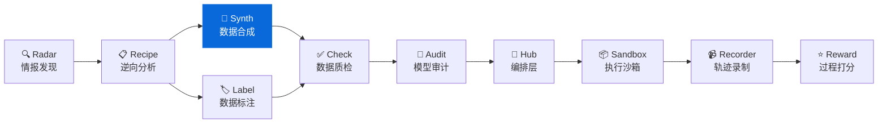

<div align="center">

# DataSynth

**数据合成工具 — 基于种子数据批量生成高质量训练数据**
**Seed-to-scale synthetic data engine for LLM training workflows**

[](https://pypi.org/project/knowlyr-datasynth/)
[](https://www.python.org/downloads/)
[](LICENSE)
[](https://github.com/liuxiaotong/data-synth/actions/workflows/ci.yml)
[](#mcp-server)

[快速开始](#快速开始) · [高级功能](#高级功能) · [交互模式](#交互模式) · [MCP Server](#mcp-server) · [验证与初始化](#验证与初始化) · [生态](#data-pipeline-生态)

</div>

---

**GitHub Topics**: `synthetic-data`, `data-generation`, `llm`, `mcp`, `ai-data-pipeline`

基于少量种子数据和 Schema 定义，使用 LLM 批量生成高质量训练数据。支持 API 模式和交互模式。

## 核心能力 / Core Capabilities

```
Schema + 种子数据 (50条) → LLM 合成 → 批量数据 (1000+条) → 质检筛选
```

- **智能模板** — 自动检测数据类型 (指令-回复 / 偏好对 / 多轮对话)，选用专用 Prompt
- **Schema 验证** — 类型检查 + 约束校验 (range / enum / length)，自动过滤不合规样本
- **去重** — 精确匹配去重，种子 + 跨批次，避免重复数据
- **并发生成** — 多批次并行调用 LLM，线程安全去重
- **增量续跑** — `--resume` 从已有输出继续，断点恢复不浪费
- **重试策略** — 自动重试 + 温度递增，提高容错和多样性
- **统计报告** — `--stats` 输出字段分布统计 (长度/范围/频率)
- **精确成本** — 按模型实际定价计算 (Claude / GPT 全系列)
- **后置钩子** — 生成完成后自动触发质检等下游命令

### 输入 / 输出示例 / Input & Output Samples

```jsonc
// seed.json
{
  "schema": {
    "fields": [
      {"name": "instruction", "type": "text"},
      {"name": "response", "type": "text"},
      {"name": "quality", "type": "int", "constraints": {"range": [1, 5]}}
    ]
  },
  "samples": [{"instruction": "解释 COT", "response": "Chain-of-thought...", "quality": 5}]
}

// output/11_合成数据/synthetic.json
[{"instruction": "给出反事实...", "response": "...", "quality": 4 }]
```

### 解决的问题 / Problems Solved

| 痛点 | 传统方案 | DataSynth |
|------|----------|-----------|
| **成本** | 人工标注 $0.1-$10/条 | LLM 生成 $0.001-$0.01/条 |
| **速度** | 人工 100条/天 | 自动 10000条/小时 |
| **规模** | 需要招人、培训 | 按需弹性生成 |
| **一致性** | 标注员理解差异 | 规则 + 模板保证一致 |

### 工作模式 / Modes

| 模式 | 说明 | 适用场景 |
|------|------|----------|
| **API 模式** | 直接调用 LLM API | 有 API key，批量生成 |
| **交互模式** | 生成 Prompt，手动调用 | Claude Code 中使用，无需 API key |

## 安装 / Installation

```bash
pip install knowlyr-datasynth
```

可选依赖：

```bash
pip install knowlyr-datasynth[anthropic]  # Anthropic Claude
pip install knowlyr-datasynth[openai]     # OpenAI GPT
pip install knowlyr-datasynth[llm]        # 两者都装
pip install knowlyr-datasynth[mcp]        # MCP 服务器
pip install knowlyr-datasynth[all]        # 全部功能
```

## 快速开始 / Quick Start

### API 模式 (需要 API key) / API Mode

```bash
# 设置 API key
export ANTHROPIC_API_KEY=your_key

# 从 DataRecipe 分析结果生成
knowlyr-datasynth generate ./analysis_output/my_dataset/ -n 100

# 并发 + JSONL 输出
knowlyr-datasynth generate ./analysis_output/my_dataset/ -n 1000 --concurrency 3 --format jsonl

# 估算成本
knowlyr-datasynth generate ./analysis_output/my_dataset/ -n 1000 --dry-run
```

<details>
<summary>输出示例</summary>

```
正在从 ./analysis_output/my_dataset/ 生成合成数据...
  目标数量: 100
  模型: claude-sonnet-4-20250514
  进度: 100/100
✓ 生成成功: ./analysis_output/my_dataset/11_合成数据/synthetic.json
  生成数量: 100
  失败数量: 0
  去重数量: 3
  Token 用量: 45,230
  预计成本: $0.1823
  耗时: 42.3s
```

</details>

### 交互模式 (无需 API key) / Interactive Mode

```bash
# 生成 Prompt
knowlyr-datasynth prepare ./analysis_output/my_dataset/ -n 10

# 将 Prompt 复制到 Claude，获取结果后解析
```

在 Claude Code 中使用更方便，见 [MCP Server](#mcp-server) 章节。

---

## 高级功能 / Advanced Features

### 增量续跑 / Resume

中断后从已有输出继续生成，不会重复已有数据：

```bash
# 首次生成 500 条（中途中断只生成了 300 条）
knowlyr-datasynth generate ./output/my_dataset/ -n 500

# 续跑，自动从第 301 条开始
knowlyr-datasynth generate ./output/my_dataset/ -n 500 --resume
```

### 数据类型自动检测 / Auto Data Type

根据 Schema 字段名自动选择最佳 Prompt 模板：

| 字段特征 | 检测为 | 专用模板 |
|---------|-------|---------|
| `instruction` + `response` | `instruction_response` | 指令-回复生成 |
| `prompt` + `chosen` + `rejected` | `preference` | 偏好对比数据 |
| `conversation` | `multi_turn` | 多轮对话生成 |

也可手动指定：`--data-type preference`

### Schema 验证 / Validation

生成的数据自动校验，不合规样本被过滤：

- **类型检查**: `text` / `int` / `float` / `bool` / `list`
- **约束检查**: `range` (数值范围)、`enum` (枚举值)、`min_length` / `max_length` (字符串长度)

```jsonc
// Schema 定义约束
{"name": "quality", "type": "int", "constraints": {"range": [1, 5]}}
{"name": "level", "type": "text", "constraints": {"enum": ["easy", "medium", "hard"]}}
```

使用 `--no-validate` 或 `validate=False` 跳过验证和去重。

### 并发生成 / Concurrency

```bash
# 3 个批次并行，加速生成
knowlyr-datasynth generate ./output/my_dataset/ -n 1000 --concurrency 3
```

### 失败重试策略 / Retry Strategy

```bash
knowlyr-datasynth generate ... --max-retries 5 --retry-delay 3 --temperature 0.4
```

- `--max-retries`：应对 429/5xx 错误
- `--retry-delay`：重试间隔秒数
- `--temperature`：重试时自动递增 0.05，提高结果多样性

### 后置钩子 / Post Hook

生成完成后自动触发下游命令：

```bash
knowlyr-datasynth generate ./output/my_dataset/ -n 1000 \
  --post-hook "knowlyr-datacheck validate {analysis_dir}"
```

支持变量: `{analysis_dir}` `{output_path}` `{count}`

### 统计报告 / Stats Report

生成后输出字段分布统计：

```bash
knowlyr-datasynth generate ./output/my_dataset/ -n 1000 --stats
```

输出 `synthetic.stats.json`：

```json
{
  "total_samples": 1000,
  "fields": {
    "instruction": {"type": "text", "count": 1000, "avg_length": 42.3, "min_length": 8, "max_length": 156},
    "response": {"type": "text", "count": 1000, "avg_length": 201.5, "min_length": 30, "max_length": 892},
    "quality": {"type": "numeric", "min": 1, "max": 5, "avg": 3.82, "distribution": {"1": 32, "2": 89, "3": 215, "4": 378, "5": 286}}
  }
}
```

### 模型定价 / Model Pricing

成本估算自动匹配模型实际定价：

| 模型 | 输入 ($/1K tokens) | 输出 ($/1K tokens) |
|------|-------|--------|
| Claude Opus | $0.015 | $0.075 |
| Claude Sonnet | $0.003 | $0.015 |
| Claude Haiku | $0.00025 | $0.00125 |
| GPT-4o | $0.0025 | $0.01 |
| GPT-4o Mini | $0.00015 | $0.0006 |

### 配置文件 / Config File

避免重复输入 CLI 参数，使用 JSON 配置文件：

```bash
# 生成配置模板
knowlyr-datasynth init

# 使用配置文件
knowlyr-datasynth generate ./output/my_dataset/ --config datasynth.config.json

# CLI 显式参数优先于配置文件
knowlyr-datasynth generate ./output/my_dataset/ --config config.json -m gpt-4o
```

`datasynth.config.json` 示例：

```json
{
  "target_count": 1000,
  "model": "claude-sonnet-4-20250514",
  "temperature": 0.8,
  "batch_size": 5,
  "concurrency": 3,
  "data_type": "auto"
}
```

---

## 验证与初始化 / Validate & Init

### 数据验证 / Validate

验证已有数据文件是否符合 Schema：

```bash
knowlyr-datasynth validate data.json schema.json
```

```
验证 1000 条数据...
  Schema: schema.json
  字段: instruction, response, quality

结果:
  ✓ 合规: 987
  ✗ 不合规: 13

错误详情 (前 10 条):
  #42: quality: 10 out of range [1, 5]
  #156: missing required field: response
  ...
```

支持 JSON 和 JSONL 格式，以及 `{samples: [{data: ...}]}` 结构。

### 项目初始化 / Init

快速创建配置和 Schema 模板：

```bash
knowlyr-datasynth init -o my_project/
```

生成三个文件：
- `datasynth.config.json` — 生成配置
- `schema.json` — 数据 Schema
- `seeds.json` — 种子数据示例

### 格式转换 / Convert

JSON 和 JSONL 互转：

```bash
# JSON → JSONL
knowlyr-datasynth convert data.json -o data.jsonl

# JSONL → JSON
knowlyr-datasynth convert data.jsonl -o data.json
```

支持 `{samples: [{data: ...}]}` 格式自动展开。

---

## 成本估算 / Costing

```bash
knowlyr-datasynth estimate -n 1000
```

```
成本估算:
  目标数量: 1000
  预计批次: 200
  预计输入 Token: 400,000
  预计输出 Token: 600,000
  预计成本: $10.20
  模型: claude-sonnet-4-20250514
```

### 不同规模的成本参考 / Scale Reference

| 数量 | 预计成本 | 预计时间 |
|------|----------|----------|
| 100 | ~$1 | ~1 分钟 |
| 1,000 | ~$10 | ~10 分钟 |
| 10,000 | ~$100 | ~2 小时 |

### 质量闭环 / Quality Loop

```
DataRecipe 输出 (Schema + Rubric)
      ↓
DataLabel 人工校准 50 条种子
      ↓
DataSynth 批量合成
      ↓
DataCheck 质检 + 回写报告
```

---

## 交互模式 / Interactive Workflow

交互模式适合在 Claude Code 中使用，不需要 API key：

### 步骤 1: 准备 Prompt

```bash
knowlyr-datasynth prepare ./analysis_output/my_dataset/ -n 10
```

### 步骤 2: 将 Prompt 发送给 Claude

复制输出的 Prompt，发送给 Claude 生成数据。

### 步骤 3: 解析结果

使用 MCP 工具 `parse_synthesis_result` 解析 Claude 的回复。

---

## MCP Server / Claude Integration

在 Claude Desktop / Claude Code 中直接使用。

### 配置 / Config

添加到 `~/Library/Application Support/Claude/claude_desktop_config.json`：

```json
{
  "mcpServers": {
    "knowlyr-datasynth": {
      "command": "uv",
      "args": ["--directory", "/path/to/data-synth", "run", "python", "-m", "datasynth.mcp_server"]
    }
  }
}
```

### 可用工具 / Tools

| 工具 | 功能 |
|------|------|
| `prepare_synthesis` | 准备合成 Prompt（交互模式，支持 data_type） |
| `parse_synthesis_result` | 解析 LLM 生成结果并保存 |
| `synthesize_data` | 直接调用 LLM 生成（支持 resume / data_type / format） |
| `validate_data` | 验证数据文件是否符合 Schema |
| `estimate_synthesis_cost` | 估算生成成本 |

### 使用示例 (交互模式) / Usage Example

```
用户: 帮我基于 ./output/SVGEditBench 生成 20 条合成数据

Claude: [调用 prepare_synthesis]
        生成 Prompt...

        [Claude 自己执行 Prompt 生成数据]

        [调用 parse_synthesis_result]
        ✓ 合成数据已保存:
        - 输出路径: ./output/SVGEditBench/11_合成数据/synthetic.json
        - 生成数量: 20
```

---

## Data Pipeline 生态 / Ecosystem

DataSynth 是 Data Pipeline 生态的合成组件：



### 生态项目

| 层 | 项目 | PyPI 包 | 说明 | 仓库 |
|---|---|---|---|---|
| 情报 | **AI Dataset Radar** | knowlyr-radar | 数据集竞争情报、趋势分析 | [GitHub](https://github.com/liuxiaotong/ai-dataset-radar) |
| 分析 | **DataRecipe** | knowlyr-datarecipe | 逆向分析、Schema 提取、成本估算 | [GitHub](https://github.com/liuxiaotong/data-recipe) |
| 生产 | **DataSynth** | knowlyr-datasynth | LLM 批量合成、种子数据扩充 | You are here |
| 生产 | **DataLabel** | knowlyr-datalabel | 轻量标注工具、多标注员合并 | [GitHub](https://github.com/liuxiaotong/data-label) |
| 质检 | **DataCheck** | knowlyr-datacheck | 规则验证、重复检测、分布分析 | [GitHub](https://github.com/liuxiaotong/data-check) |
| 质检 | **ModelAudit** | knowlyr-modelaudit | 蒸馏检测、模型指纹、身份验证 | [GitHub](https://github.com/liuxiaotong/model-audit) |
| Agent | **knowlyr-agent** | knowlyr-sandbox / recorder / reward / hub | 沙箱 + 轨迹录制 + Reward + 编排 | [GitHub](https://github.com/liuxiaotong/knowlyr-agent) |

### 端到端工作流 / End-to-end Flow

```bash
# 1. DataRecipe: 分析数据集，生成 Schema 和样例
knowlyr-datarecipe deep-analyze tencent/CL-bench -o ./output

# 2. DataLabel: 生成标注界面，人工标注/校准种子数据
knowlyr-datalabel generate ./output/tencent_CL-bench/

# 3. DataSynth: 基于种子数据批量合成
knowlyr-datasynth generate ./output/tencent_CL-bench/ -n 1000 --concurrency 3

# 4. DataCheck: 质量检查
knowlyr-datacheck validate ./output/tencent_CL-bench/
```

### 四合一 MCP 配置 / Quad MCP Config

```json
{
  "mcpServers": {
    "knowlyr-datarecipe": {
      "command": "uv",
      "args": ["--directory", "/path/to/data-recipe", "run", "knowlyr-datarecipe-mcp"]
    },
    "knowlyr-datalabel": {
      "command": "uv",
      "args": ["--directory", "/path/to/data-label", "run", "python", "-m", "datalabel.mcp_server"]
    },
    "knowlyr-datasynth": {
      "command": "uv",
      "args": ["--directory", "/path/to/data-synth", "run", "python", "-m", "datasynth.mcp_server"]
    },
    "knowlyr-datacheck": {
      "command": "uv",
      "args": ["--directory", "/path/to/data-check", "run", "python", "-m", "datacheck.mcp_server"]
    }
  }
}
```

---

## 命令参考

| 命令 | 功能 |
|------|------|
| `knowlyr-datasynth generate <dir>` | 从 DataRecipe 分析结果生成 (API 模式) |
| `knowlyr-datasynth generate <dir> --dry-run` | 仅估算成本 |
| `knowlyr-datasynth generate <dir> --resume` | 增量续跑 |
| `knowlyr-datasynth generate <dir> --stats` | 输出统计报告 |
| `knowlyr-datasynth create <schema> <seeds> -o <out>` | 从自定义文件生成 |
| `knowlyr-datasynth create ... --dry-run` | 仅估算成本 |
| `knowlyr-datasynth prepare <dir>` | 准备 Prompt (交互模式) |
| `knowlyr-datasynth prepare <dir> --data-type preference` | 指定数据类型 |
| `knowlyr-datasynth validate <data> <schema>` | 验证数据合规性 |
| `knowlyr-datasynth init` | 生成配置和 Schema 模板 |
| `knowlyr-datasynth convert <input> -o <output>` | 转换格式 (JSON ↔ JSONL) |
| `knowlyr-datasynth estimate -n <count>` | 估算成本 |

### 生成选项

| 选项 | 说明 | 默认值 |
|------|------|--------|
| `-n, --count` | 生成数量 | 100 |
| `-m, --model` | LLM 模型 | claude-sonnet-4-20250514 |
| `-p, --provider` | 提供商 (`anthropic` / `openai`) | anthropic |
| `-t, --temperature` | 采样温度 (重试时自动递增 0.05) | 0.8 |
| `--batch-size` | 每批数量 | 5 |
| `--max-retries` | 失败重试次数 | 3 |
| `--retry-delay` | 重试间隔秒数 | 2.0 |
| `--concurrency` | 并发批次数 | 1 |
| `--format` | 输出格式 (`json` / `jsonl`) | json |
| `--data-type` | 数据类型 (`auto` / `instruction_response` / `preference` / `multi_turn`) | auto |
| `--resume` | 增量续跑：从已有输出继续生成 | — |
| `--stats` | 输出字段分布统计 JSON | — |
| `--post-hook` | 生成后执行的命令 | — |
| `--no-validate` | 跳过 Schema 验证和去重 | — |
| `--config` | JSON 配置文件 (CLI 参数优先) | — |
| `--dry-run` | 仅估算成本，不生成 (显示 Schema 信息) | — |

---

## API 使用

```python
from datasynth import DataSynthesizer, SynthesisConfig

# 配置
config = SynthesisConfig(
    target_count=100,
    model="claude-sonnet-4-20250514",
    provider="anthropic",
    temperature=0.8,
    concurrency=3,        # 并发批次
    data_type="auto",     # 自动检测数据类型
)

# 生成
synthesizer = DataSynthesizer(config)
result = synthesizer.synthesize_from_datarecipe(
    analysis_dir="./output/my_dataset/",
    output_format="jsonl",  # 输出 JSONL
    resume=True,            # 增量续跑
)

print(f"生成数量: {result.generated_count}")
print(f"去重数量: {result.dedup_count}")
print(f"失败数量: {result.failed_count}")
print(f"成本: ${result.estimated_cost:.4f}")

# 统计报告
if result.stats:
    for field, info in result.stats["fields"].items():
        print(f"  {field}: {info}")
```

---

## 项目架构

```
src/datasynth/
├── __init__.py       # 版本和公共导出
├── __main__.py       # python -m datasynth 入口
├── synthesizer.py    # 核心合成器 (API + 交互模式)
├── prompts.py        # Prompt 模板 (通用 + 专用) 和解析
├── config.py         # 配置、Schema 定义、验证
├── cli.py            # CLI 命令行 (Click)
└── mcp_server.py     # MCP Server (5 工具)
```

---

## License

[MIT](LICENSE)

<div align="center">
<sub><a href="https://github.com/liuxiaotong">knowlyr</a> 数据工程生态 · 种子到规模化数据合成</sub>
</div>
