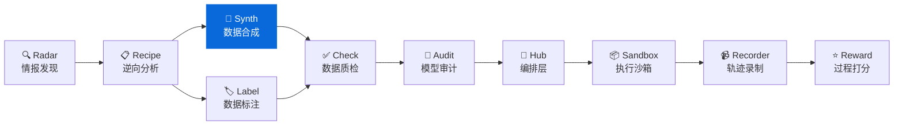
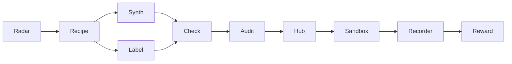

<div align="center">

# DataSynth

**数据合成工具 - 基于种子数据批量生成高质量训练数据**  
**Seed-to-scale synthetic data engine built for LLM workflows**

[](https://pypi.org/project/knowlyr-datasynth/)
[](https://www.python.org/downloads/)
[](LICENSE)
[](#mcp-server)

[快速开始](#快速开始) · [交互模式](#交互模式) · [MCP Server](#mcp-server) · [Data Pipeline 生态](#data-pipeline-生态)

</div>

---

**GitHub Topics**: `synthetic-data`, `llm`, `data-generation`, `mcp`, `data-pipeline`

基于少量种子数据和 Schema 定义，使用 LLM 批量生成高质量训练数据。支持 API 模式和交互模式。

## 核心能力 / Core Capabilities

```
Schema + 种子数据 (50条) → LLM 合成 → 批量数据 (1000+条) → 质检筛选
```

### 输入 / 输出示例 / Input & Output Samples

```jsonc
// seed.json
{
  "schema": {
    "fields": [
      {"name": "instruction", "type": "text"},
      {"name": "response", "type": "text"},
      {"name": "quality", "type": "int", "range": [1,5]}
    ]
  },
  "samples": [{"instruction": "解释 COT", "response": "Chain-of-thought...", "quality": 5}]
}

// output/11_合成数据/synthetic.json
[{"instruction": "给出反事实...", "response": "...", "quality": 4 }]
```

### 解决的问题 / Problems Solved

| 痛点 | 传统方案 | DataSynth |
|------|----------|-----------|
| **成本** | 人工标注 $0.1-$10/条 | LLM 生成 $0.001-$0.01/条 |
| **速度** | 人工 100条/天 | 自动 10000条/小时 |
| **规模** | 需要招人、培训 | 按需弹性生成 |
| **一致性** | 标注员理解差异 | 规则 + 模板保证一致 |

### 工作模式 / Modes

| 模式 | 说明 | 适用场景 |
|------|------|----------|
| **API 模式** | 直接调用 LLM API | 有 API key，批量生成 |
| **交互模式** | 生成 Prompt，手动调用 | Claude Code 中使用，无需 API key |

## 安装 / Installation

```bash
pip install knowlyr-datasynth
```

可选依赖：

```bash
pip install knowlyr-datasynth[anthropic]  # Anthropic Claude
pip install knowlyr-datasynth[openai]     # OpenAI GPT
pip install knowlyr-datasynth[llm]        # 两者都装
pip install knowlyr-datasynth[mcp]        # MCP 服务器
pip install knowlyr-datasynth[all]        # 全部功能
```

## 快速开始 / Quick Start

### API 模式 (需要 API key) / API Mode

```bash
# 设置 API key
export ANTHROPIC_API_KEY=your_key

# 从 DataRecipe 分析结果生成
knowlyr-datasynth generate ./analysis_output/my_dataset/ -n 100

# 估算成本
knowlyr-datasynth generate ./analysis_output/my_dataset/ -n 1000 --dry-run
```

<details>
<summary>输出示例</summary>

```
正在从 ./analysis_output/my_dataset/ 生成合成数据...
  目标数量: 100
  模型: claude-sonnet-4-20250514
  进度: 100/100
✓ 生成成功: ./analysis_output/my_dataset/11_合成数据/synthetic.json
  生成数量: 100
  失败数量: 0
  Token 用量: 45,230
  预计成本: $0.1823
  耗时: 42.3s
```

</details>

### 交互模式 (无需 API key) / Interactive Mode

```bash
# 生成 Prompt
knowlyr-datasynth prepare ./analysis_output/my_dataset/ -n 10

# 将 Prompt 复制到 Claude，获取结果后解析
```

在 Claude Code 中使用更方便，见 [MCP Server](#mcp-server) 章节。

---

## 成本估算 / Costing

```bash
knowlyr-datasynth estimate -n 1000
```

```
成本估算:
  目标数量: 1000
  预计批次: 200
  预计输入 Token: 400,000
  预计输出 Token: 600,000
  预计成本: $10.20
  模型: claude-sonnet-4-20250514
```

### 不同规模的成本参考 / Scale Reference

| 数量 | 预计成本 | 预计时间 |
|------|----------|----------|
| 100 | ~$1 | ~1 分钟 |
| 1,000 | ~$10 | ~10 分钟 |
| 10,000 | ~$100 | ~2 小时 |

### 质量闭环 / Quality Loop

```
DataRecipe 输出 (Schema + Rubric)
      ↓
DataLabel 人工校准 50 条种子
      ↓
DataSynth 批量合成
      ↓
DataCheck 质检 + 回写报告
```

在 CLI 中可通过 `knowlyr-datasynth generate ... --post-hook "knowlyr-datacheck validate {analysis_dir}"` 自动触发后置质检。

---

## 交互模式 / Interactive Workflow

交互模式适合在 Claude Code 中使用，不需要 API key：

### 步骤 1: 准备 Prompt

```bash
knowlyr-datasynth prepare ./analysis_output/my_dataset/ -n 10
```

### 步骤 2: 将 Prompt 发送给 Claude

复制输出的 Prompt，发送给 Claude 生成数据。

### 步骤 3: 解析结果

使用 MCP 工具 `parse_synthesis_result` 解析 Claude 的回复。

---

## Prompt 指南 / Prompt Guide

### 模板 / Template

```
You are a data generation engine...
- Field definitions: {{schema}}
- Style guide: {{rubric}}
- Examples ({{seed_count}}): {{seed_examples}}
Generate {{batch_size}} samples in JSONL format.
```

- `batch_size` 建议 ≤20，过大容易触发限流或超时。
- 根据任务敏感度添加「不得输出 PII / 不得引用真实用户」等约束，降低审查失败概率。
- 冗长 schema 可分块粘贴 (`schema://chunk/<n>`) 以保持 Prompt < 8k tokens。

### 失败重试策略 / Retry Strategy

```bash
knowlyr-datasynth generate ... --max-retries 5 --retry-delay 3 --temperature 0.4
```

- `--max-retries`：应对 429/5xx。
- `--retry-delay`：大型模型常见 2-5 秒冷却时间。
- `--temperature`：偏低→一致性，偏高→多样性；可在重试时递增 0.05。

---

## MCP Server / Claude Integration

在 Claude Desktop / Claude Code 中直接使用。

### 配置 / Config

添加到 `~/Library/Application Support/Claude/claude_desktop_config.json`：

```json
{
  "mcpServers": {
    "knowlyr-datasynth": {
      "command": "uv",
      "args": ["--directory", "/path/to/data-synth", "run", "python", "-m", "datasynth.mcp_server"]
    }
  }
}
```

### 可用工具 / Tools

| 工具 | 功能 |
|------|------|
| `prepare_synthesis` | 准备合成 Prompt（交互模式） |
| `parse_synthesis_result` | 解析 LLM 生成结果并保存 |
| `synthesize_data` | 直接调用 LLM 生成（需要 API key） |
| `estimate_synthesis_cost` | 估算生成成本 |

### 使用示例 (交互模式) / Usage Example

```
用户: 帮我基于 ./output/SVGEditBench 生成 20 条合成数据

Claude: [调用 prepare_synthesis]
        生成 Prompt...

        [Claude 自己执行 Prompt 生成数据]

        [调用 parse_synthesis_result]
        ✓ 合成数据已保存:
        - 输出路径: ./output/SVGEditBench/11_合成数据/synthetic.json
        - 生成数量: 20
```

---

## Data Pipeline 生态 / Ecosystem

DataSynth 是 Data Pipeline 生态的合成组件：



### 生态项目

| 层 | 项目 | 说明 | 仓库 |
|---|---|---|---|
| 情报 | **AI Dataset Radar** | 数据集竞争情报、趋势分析 | [GitHub](https://github.com/liuxiaotong/ai-dataset-radar) |
| 分析 | **DataRecipe** | 逆向分析、Schema 提取、成本估算 | [GitHub](https://github.com/liuxiaotong/data-recipe) |
| 生产 | **DataSynth** | LLM 批量合成、种子数据扩充 | You are here |
| 生产 | **DataLabel** | 轻量标注工具、多标注员合并 | [GitHub](https://github.com/liuxiaotong/data-label) |
| 质检 | **DataCheck** | 规则验证、重复检测、分布分析 | [GitHub](https://github.com/liuxiaotong/data-check) |
| 质检 | **ModelAudit** | 蒸馏检测、模型指纹、身份验证 | [GitHub](https://github.com/liuxiaotong/model-audit) |
| Agent | **AgentSandbox** | Docker 执行沙箱、轨迹重放 | [GitHub](https://github.com/liuxiaotong/agent-sandbox) |
| Agent | **AgentRecorder** | 标准化轨迹录制、多框架适配 | [GitHub](https://github.com/liuxiaotong/agent-recorder) |
| Agent | **AgentReward** | 过程级 Reward、Rubric 多维评估 | [GitHub](https://github.com/liuxiaotong/agent-reward) |
| 编排 | **TrajectoryHub** | Pipeline 编排、数据集导出 | [GitHub](https://github.com/liuxiaotong/agent-trajectory-hub) |

### 端到端工作流 / End-to-end Flow

```bash
# 1. DataRecipe: 分析数据集，生成 Schema 和样例
knowlyr-datarecipe deep-analyze tencent/CL-bench -o ./output

# 2. DataLabel: 生成标注界面，人工标注/校准种子数据
knowlyr-datalabel generate ./output/tencent_CL-bench/

# 3. DataSynth: 基于种子数据批量合成
knowlyr-datasynth generate ./output/tencent_CL-bench/ -n 1000

# 4. DataCheck: 质量检查
knowlyr-datacheck validate ./output/tencent_CL-bench/
```

### 四合一 MCP 配置 / Quad MCP Config

```json
{
  "mcpServers": {
    "knowlyr-datarecipe": {
      "command": "uv",
      "args": ["--directory", "/path/to/data-recipe", "run", "knowlyr-datarecipe-mcp"]
    },
    "knowlyr-datalabel": {
      "command": "uv",
      "args": ["--directory", "/path/to/data-label", "run", "python", "-m", "datalabel.mcp_server"]
    },
    "knowlyr-datasynth": {
      "command": "uv",
      "args": ["--directory", "/path/to/data-synth", "run", "python", "-m", "datasynth.mcp_server"]
    },
    "knowlyr-datacheck": {
      "command": "uv",
      "args": ["--directory", "/path/to/data-check", "run", "python", "-m", "datacheck.mcp_server"]
    }
  }
}
```

---

## 命令参考

| 命令 | 功能 |
|------|------|
| `knowlyr-datasynth generate <dir>` | 从 DataRecipe 分析结果生成 (API 模式) |
| `knowlyr-datasynth generate <dir> --dry-run` | 仅估算成本 |
| `knowlyr-datasynth create <schema> <seeds> -o <out>` | 从自定义文件生成 |
| `knowlyr-datasynth prepare <dir>` | 准备 Prompt (交互模式) |
| `knowlyr-datasynth estimate -n <count>` | 估算成本 |

### 生成选项

| 选项 | 说明 | 默认值 |
|------|------|--------|
| `-n, --count` | 生成数量 | 100 |
| `-m, --model` | LLM 模型 | claude-sonnet-4-20250514 |
| `-p, --provider` | 提供商 | anthropic |
| `-t, --temperature` | 采样温度 | 0.8 |
| `--batch-size` | 每批数量 | 5 |

---

## API 使用

```python
from datasynth import DataSynthesizer, SynthesisConfig

# 配置
config = SynthesisConfig(
    target_count=100,
    model="claude-sonnet-4-20250514",
    provider="anthropic",
    temperature=0.8,
)

# 生成
synthesizer = DataSynthesizer(config)
result = synthesizer.synthesize_from_datarecipe(
    analysis_dir="./output/my_dataset/",
)

print(f"生成数量: {result.generated_count}")
print(f"成本: ${result.estimated_cost:.4f}")
```

---

## 项目架构

```
src/datasynth/
├── synthesizer.py    # 核心合成器
├── prompts.py        # Prompt 模板和解析
├── config.py         # 配置和 Schema
├── cli.py            # CLI 命令行
└── mcp_server.py     # MCP Server (4 工具)
```

---

## License

[MIT](LICENSE)

---

## AI Data Pipeline 生态

> 10 个工具覆盖 AI 数据工程全流程，均支持 CLI + MCP，可独立使用也可组合成流水线。

| Tool | Description | Link |
|------|-------------|------|
| **AI Dataset Radar** | Competitive intelligence for AI training datasets | [GitHub](https://github.com/liuxiaotong/ai-dataset-radar) |
| **DataRecipe** | Reverse-engineer datasets into annotation specs & cost models | [GitHub](https://github.com/liuxiaotong/data-recipe) |
| **DataSynth** | Seed-to-scale synthetic data generation | You are here |
| **DataLabel** | Lightweight, serverless HTML labeling tool | [GitHub](https://github.com/liuxiaotong/data-label) |
| **DataCheck** | Automated quality checks & anomaly detection | [GitHub](https://github.com/liuxiaotong/data-check) |
| **ModelAudit** | LLM distillation detection & model fingerprinting | [GitHub](https://github.com/liuxiaotong/model-audit) |
| **AgentSandbox** | Reproducible Docker sandbox for Code Agent execution | [GitHub](https://github.com/liuxiaotong/agent-sandbox) |
| **AgentRecorder** | Standardized trajectory recording for Code Agents | [GitHub](https://github.com/liuxiaotong/agent-recorder) |
| **AgentReward** | Process-level rubric-based reward engine | [GitHub](https://github.com/liuxiaotong/agent-reward) |
| **TrajectoryHub** | Pipeline orchestrator for Agent trajectory data | [GitHub](https://github.com/liuxiaotong/agent-trajectory-hub) |



---

<div align="center">
<sub>为数据团队提供低成本、高效率的数据扩充方案</sub>
</div>
